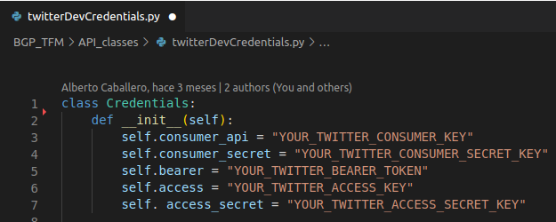

# Sistema de recomendación de políticas de tráfico BGP

Resumen
============
Las tecnologías de la información y comunicación son áreas de investigación en constante crecimiento. Los numerosos avances del sector proporcionan herramientas para acceder a una gran variedad de información y servicios desde cualquier parte del mundo. Estas herramientas se podrían resumir en una única palabra, Internet.

Internet es una herramienta de carácter global cuyo funcionamiento es posible gracias a complejos mecanismos y protocolos desarrollados a lo largo de la historia. Cada uno de estos mecanismos se encarga de gestionar una característica concreta, siendo BGP (*Border Gateway Protocol*) uno de los protocolos más relevantes sobre los que se sostiene Internet. Sin embargo, este protocolo que se encarga del intercambio de información de encaminamiento global, es gestionado y configurado de manera local por los diferentes ISP (*Internet Service Provider*), empresas tecnológicas, universidades, agencias gubernamentales e instituciones científicas. Esto hace que los intereses particulares de algunas entidades intervengan en el encaminamiento del tráfico de red, causando en ocasiones ciertos problemas.

En este trabajo se presenta un estudio acerca de los diferentes problemas que alberga este protocolo, proporcionando un medio para observar los eventos que se producen y recomendando posibles configuraciones con el fin de evitar interrupciones de servicio inesperadas o el secuestro indeseado de prefijos.

**Palabras clave**
   
BGP (*Border Gateway Protocol*), AS (*Autonomous System*), *Outages*, *Hijacks*, BGPMon, BGPStream

Puesta en marcha de la aplicación
=================================
Dentro de este proyecto se encuentra la carpeta denominada
`/dependencies_installation_dir` que contiene el archivo
`requirements.txt` con la información de las dependencias necesarias.

BgpRS actualmente solo esta preparado para funcionar en distribuciones de Linux, se debe
proceder a crear un entorno virtual de Python3 para instalar las citadas
dependencias. Esto ultimo se puede realizar mediante los pasos
enumerados a continuación.

1.  **Creación del entorno virtual:**

    `python3 -m venv venv`

2.  **Activación del entrono virtual:**

    `source venv/bin/activate`

3.  **Instalación de dependencias del proyecto:**

    `pip install -r dependencies_installation_dir/requirements.txt`

De todas las dependencias que se instalaran, podría decirse que las mas
relevantes son las librerías de TweePy [@tweepy] y Pydrive [@pydrive].
Es importante destacar que estas dos librerías necesitan de permisos y
la asignación de credenciales para cumplir con su cometido, siendo
necesaria su especificación en el código de la aplicación. En
consecuencia de esto, se proporciona este capitulo con el fin de conocer
características a más bajo nivel de la aplicación y mostrar cómo dar
funcionamiento a la aplicación.

Twitter API
-----------

Como se repetido en múltiples ocasiones, las información obtenida a
través de la API de Twitter tiene enorme relevancia para BgpRS. Sin
embargo, para que la aplicación pueda utilizar las funcionalidades de
esta API, es necesario seguir ciertas directrices que se detallan a
continuación.

En primer lugar, es necesario puntualizar que BgpRS utiliza funciones de
esta API que solo están disponibles con los permisos que otorga el plan
*Academic Research* de Twitter, la necesidad de esto se ha podido ver en
detalle en la sección
[\[sec:problemasObInfo\]](#sec:problemasObInfo){reference-type="ref"
reference="sec:problemasObInfo"} de esta memoria. Por ello, el primer
paso necesario para poner en marcha la aplicación será solicitar acceso
a al plan mencionado.

Para poder realizar la solicitud correspondiente, primero se debe tener
una cuenta de Twitter para realizar el registro en la plataforma
*developer* [^1] de esta entidad. Este proceso de solicitud es bastante
intuitivo. Sin embargo, como el acceso a este plan esta restringido para
ciertos usuarios, se requiere del consentimiento de Twitter, por lo que
será necesario el intercambio de cierta cantidad de *e-mails*.

Una ver realizado todo esto, sera posible crear un proyecto con el fin
de poder dar acceso a los servicios a la aplicación BgpRS. Si todo el
proceso se ha realizado correctamente, el nuevo perfil de *Twitter
Developer* se asemejará al representado en la <a href="#academicRese">Figura 1</a>.

<a name="academicRese">Permisos *Academic Research* en Twitter, *fuente:
<https://developer.twitter.com/en/portal/products>*</a>

### Asignación de credenciales dentro de BgpRS

Una vez obtenido el acceso al plan *Academic Research*, será posible
obtener las credenciales necesarias para que TweePy [@tweepy] pueda
ejecutar las solicitudes de BgpRS. El acceso a estas credenciales y su
lectura se puede realizar a través del portal *developer* de Twitter tal
y como se representa en la <a href="#credenAcc">Figura 2</a>.

<a name="credenAcc">Acceso a credenciales de Twitter, *fuente:
<https://developer.twitter.com/en/portal/projects/1495420932801785863/apps/23448073/keys>*</a>

Con estas credenciales en nuestra posesión, ya solo se necesita
especificar su valor dentro del código de BgpRS. Esto se debe realizar
mediante la modificación del archivo `twitterDevCredentials.py` situado
en la carpeta `/API_classes`, asignando valor a cada una de las
variables mostradas en la <a href="#credenTwit">Figura 3</a>.

 Archivo en BgpRS para introducir las credenciales de Twitter

Una vez realizados todos estos pasos, la aplicación será capaz de
obtener y actualizar la información de eventos BGP identificados por
Cisco. Sin embargo, para proceder a su almacenamiento, se necesita
realizar proceso similar para la librería de PyDrive [@pydrive], el cual
se detalla en la siguiente sección.

Google API
----------

Para poder ejecutar BgpRS sin errores, es fundamental seguir los pasos
que se describen en esta sección, en esta, se podrá observar cuales son
los requerimientos para que la aplicación se pueda conectar a los
servicios de Google Drive. Para poder obtener las credenciales
necesarias para la aplicación, es necesario poseer en una cuenta de
Gmail y acceder a la consola de *Google Cloud Platform* [^2]. A través
de esta consola, se podrá crear un proyecto para posteriormente activar
el servicio correspondiente de Google Drive.

<a name="credenDrive">Credenciales de Google Drive, *fuente:
<https://console.cloud.google.com/apis/credentials?authuser=1&project=phrasal-clover-312717>*</a>

En la <a href="#credenDrive">Figura 4</a> se representa el proceso para crear y
obtener las credenciales necesarias para hacer uso de las
funcionalidades de PyDrive [@pydrive]. En primer lugar, se deberá
ingresar en el menú de `API y servicios`, y dentro de este, en el
apartado de `Credenciales` para crear unas del tipo
`ID de cliente de OAuth`. Para completar el proceso se deberán rellenar
los campos solicitados, si todo se realiza de la manera correcta, se
podrá acceder a las credenciales, que en el caso ilustrado son las
denominadas como `bgp_stream`.

Siguiendo la misma imagen, si se navega a través del frontal de la
consola, se encontrará el botón de descarga resaltado en verde (3). Si
presionamos este botón, se desplegará una pestaña como la resaltada en
color morado (4) y se podrán obtener las credenciales que necesita
BgpRS.

Dentro del proyecto de BgpRs, se deberá crear un archivo de extensión
`.yaml`, que deberá denominarse `settings.yaml` y deberá situarse en la
raíz siguiendo la imagen
[\[fig:OrgDirectorios\]](#fig:OrgDirectorios){reference-type="ref"
reference="fig:OrgDirectorios"}. Este archivo, servirá para indicar las
credenciales de Google Drive a la aplicación BgpRS, por lo que deberá
poseer la información representada en la imagen
[\[fig:credenGdriveYaml\]](#fig:credenGdriveYaml){reference-type="ref"
reference="fig:credenGdriveYaml"}.

En el archivo `settings.yaml`, se deberá dar valor a los campos
`client_secret` y `client_id` con la información de las credenciales de
Google Drive [^3]. Una vez configurado este archivo, cuando ejecutemos
la aplicación por primera vez, se abrirá una pestaña en el navegador
pidiendo la confirmación de permisos de usuario. Si aceptan dichos
permisos, se generaran automáticamente los archivos `credentials.json` y
`client_secrets.json` con la información necesaria para no tener que
realizar esta acción en las próximas ejecuciones.

### Asignación de identificadores de carpeta dentro de BgpRS

Con los pasos realizados anteriormente, ya solo es necesario crear una
carpeta de Drive donde BgpRS almacenará y obtendrá la diferente
información. Esta carpeta, deberá estar organizada de manera similar a
la representada en la <a href="#distriDrive">Figura 5</a> . El nombre de estas carpetas no tiene
porque ser idéntico, ya que de estas, como se vera mas adelante, solo se
utilizará el identificador de las mismas.

<a name="distriDrive">Distribución de carpetas en Google Drive, *fuente:
<https://drive.google.com/drive/u/1/folders/1dwxWQoyJvVZeOto3X0QjDy3VhQ6jhmuL>*</a>

El contenido de estas carpetas tiene diferente significado para BgpRS.
Por un lado, la carpeta `/Scrapped_From_Twitter` contendrá el archivo
donde se guardaran y actualizaran los datos obtenidos de Twitter. Este
archivo sera utilizado por la aplicación para clasificar la información,
generando como resultado un archivo analizable para la misma que será
almacenado en la carpeta `/Classified_By_BgpRS`.

Por ultimo, la aplicación incorpora funcionalidades aumentar estos datos
de manera estático, para realizar esto, la aplicación obtendrá la
información del archivo almacenado en la carpeta `/Classified_By_BgpRS`
y la actualizará con los nuevos datos. Después de realizar todo esto, se
generará un nuevo archivo que se almacenará en la carpeta
`/Posible_Extended_Data`.

Una vez creadas las tres carpetas, se deberán obtener sus
identificadores, ya que como se ha mencionado, la aplicación necesitara
conocer su valor. Esta información se puede extraer del mismo navegador,
ya que en la ultima parte de la *url* de cada una de estas carpetas se
encuentra su identificador. El proceso de obtención de estos
identificadores se puede observar en la <a href="#folderids">Figura 6</a>.

<a name="folderids">Obtención de identificadores de carpeta, *fuente:
<https://drive.google.com/drive/u/1/folders/1pV892qsDAl28h7ivBVX3PqiMeF1oQmNK></a>

Una vez obtenidos cada uno de los identificadores, solo hace falta
indicarlos en la parte correspondiente del código de BgpRS. Esta
asignación, debe realizarse en el archivo `Data_classifier_class.py` que
se encuentra situado dentro de la carpeta `/API_classes`. Según esto
ultimo, el valor de estos identificadores de carpeta se deberá indicar
sobre las variables que se resaltan en rojo en la figura
[1.7](#fig:IDSBGPRSGDRIVE){reference-type="ref"
reference="fig:IDSBGPRSGDRIVE"}.

![Asignación de identificadores de carpeta en
BgpRS[]{label="fig:IDSBGPRSGDRIVE"}](IMG/CAP7/Carpetas_gDrive_bgpRS.PNG){#fig:IDSBGPRSGDRIVE
width="60%"}

Con cada uno de estos pasos realizados, BgpRS estará capacitado para
almacenar y obtener la información necesaria para su funcionamiento,
proporcionando la posibilidad de obtener, actualizar y analizar los
datos al usuario a través su interfaz gráfica.

[^1]: Twitter Developer:
    <https://developer.twitter.com/en/portal/products>

[^2]: Google Cloud Platform: <https://cloud.google.com/>

[^3]: Información obtenida en el paso 4 de la imagen
    [1.4](#fig:credenGdriveP1){reference-type="ref"
    reference="fig:credenGdriveP1"}

